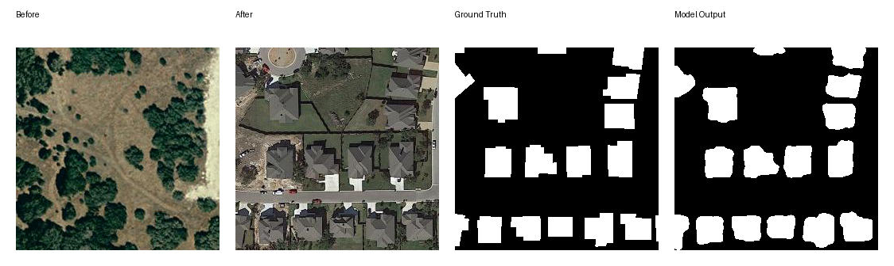
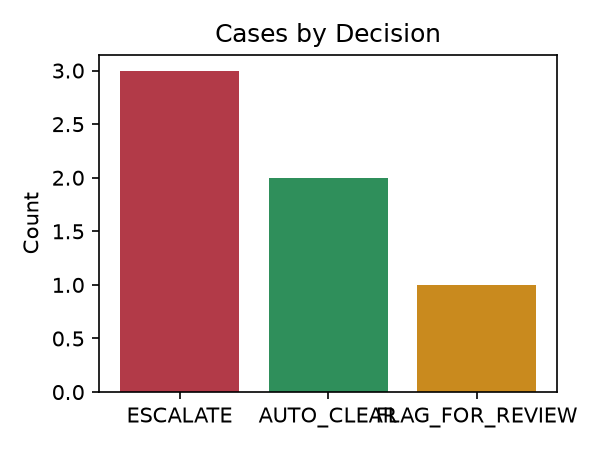
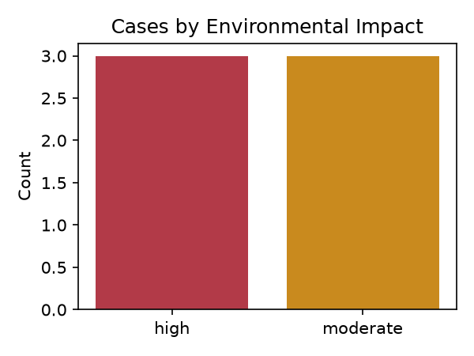
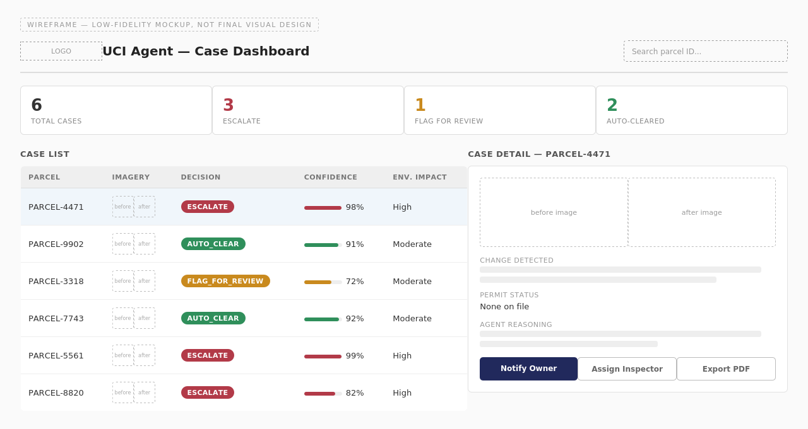

# UCI Agent — Urban Change Intelligence Agent

A 4-agent AI pipeline for detecting unauthorized construction using satellite imagery, built for Presight's AI Engineer Graduate Program Innovation Challenge.

## What it does

Compares before/after satellite image pairs, reasons over the detected change against permit records, and produces a decision per case: AUTO_CLEAR, FLAG_FOR_REVIEW, or ESCALATE.

## Architecture

Four agents orchestrated with LangGraph:
- **Perception Agent** — reads before/after images (Claude multimodal), describes the change and its severity
- **Environmental Agent** — assesses environmental impact from the same images
- **Compliance Agent** — checks the change against permit records, applies a confidence-threshold override rule
- **Reporting Agent** — generates a PDF case report with charts and per-case detail

## Data

Sample satellite image pairs from the [LEVIR-CD](https://github.com/justchenhao/STANet) dataset (via the STANet reference implementation), used here for demonstration only.

## Running it

```bash
conda create -n presight-agent python=3.12
conda activate presight-agent
pip install langgraph anthropic reportlab matplotlib pillow
export ANTHROPIC_API_KEY=your_key_here
python run_pipeline.py
```

## Results

Tested end-to-end across 6 real image pairs: 3 ESCALATE / 2 AUTO_CLEAR / 1 FLAG_FOR_REVIEW, verified with real Anthropic API calls. See `report.pdf` for the full case-by-case breakdown.

## Example Output

**Before/after change detection:**



**Decision breakdown across the 6 test cases:**



**Environmental severity breakdown:**



**Inspector dashboard wireframe (low-fidelity mockup):**



## Author

Zainab Aldhanhani — built for Presight's AI Engineer Graduate Program Innovation Challenge.
